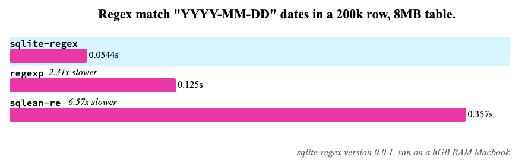

# sqlite-regex

A fast and performant SQLite extension for regular expressions. Based on [`sqlite-loadable-rs`](https://github.com/asg017/sqlite-loadable-rs), and the [regex crate](https://crates.io/crates/regex).

See [_Introducing sqlite-regex: The fastest Regular Expression Extension for SQLite_](https://observablehq.com/@asg017/introducing-sqlite-regex) (Jan 2023) for more details!

If your company or organization finds this library useful, consider [supporting my work](#supporting)!



## Usage

```sql
.load ./regex0
select 'foo' regexp 'f';

```

**Find all occurrences of a pattern in a string**

```sql
select regex_find(
  '[0-9]{3}-[0-9]{3}-[0-9]{4}',
  'phone: 111-222-3333'
);
-- '111-222-3333'

select rowid, *
from regex_find_all(
  '\b\w{13}\b',
  'Retroactively relinquishing remunerations is reprehensible.'
);
/*
┌───────┬───────┬─────┬───────────────┐
│ rowid │ start │ end │     match     │
├───────┼───────┼─────┼───────────────┤
│ 0     │ 0     │ 13  │ Retroactively │
│ 1     │ 14    │ 27  │ relinquishing │
│ 2     │ 28    │ 41  │ remunerations │
│ 3     │ 45    │ 58  │ reprehensible │
└───────┴───────┴─────┴───────────────┘
*/
```

**Extract capture group values by index or name**

```sql
select
  regex_capture(captures, 0)        as entire_match,
  regex_capture(captures, 'title')  as title,
  regex_capture(captures, 'year')   as year
from regex_captures(
  regex("'(?P<title>[^']+)'\s+\((?P<year>\d{4})\)"),
  "'Citizen Kane' (1941), 'The Wizard of Oz' (1939), 'M' (1931)."
);
/*
┌───────────────────────────┬──────────────────┬──────┐
│       entire_match        │      title       │ year │
├───────────────────────────┼──────────────────┼──────┤
│ 'Citizen Kane' (1941)     │ Citizen Kane     │ 1941 │
│ 'The Wizard of Oz' (1939) │ The Wizard of Oz │ 1939 │
│ 'M' (1931)                │ M                │ 1931 │
└───────────────────────────┴──────────────────┴──────┘
*/
```

**Use RegexSets to match a string on multiple patterns in linear time**

```sql
select regexset_is_match(
  regexset(
    "bar",
    "foo",
    "barfoo"
  ),
  'foobar'
)
```

**Split the string on the given pattern delimiter**

```sql
select rowid, *
from regex_split('[ \t]+', 'a b     c d    e');
/*
┌───────┬──────┐
│ rowid │ item │
├───────┼──────┤
│ 0     │ a    │
│ 1     │ b    │
│ 2     │ c    │
│ 3     │ d    │
│ 4     │ e    │
└───────┴──────┘
*/
```

**Replace occurrences of a pattern with another string**

```sql
select regex_replace(
  '(?P<last>[^,\s]+),\s+(?P<first>\S+)',
  'Springsteen, Bruce',
  '$first $last'
);
-- 'Bruce Springsteen'

select regex_replace_all('a', 'abc abc', '');
-- 'bc bc'
```

## Documentation

See [`docs.md`](./docs.md) for a full API reference.

## Installing

| Language       | Install                                                        |                                                                                                                                                                                               |
| -------------- | -------------------------------------------------------------- | --------------------------------------------------------------------------------------------------------------------------------------------------------------------------------------------- |
| Python         | `pip install sqlite-regex`                                     | [](https://pypi.org/project/sqlite-regex/)                                                      |
| Datasette      | `datasette install datasette-sqlite-regex`                     | [](https://datasette.io/plugins/datasette-sqlite-regex) |
| Node.js        | `npm install sqlite-regex`                                     | [](https://www.npmjs.com/package/sqlite-regex)                                                |
| Deno           | [`deno.land/x/sqlite_regex`](https://deno.land/x/sqlite_regex) | [](https://deno.land/x/sqlite_regex)        |
| Ruby           | `gem install sqlite-regex`                                     |                                                                                                      |
| Github Release |                                                                |                        |
| Rust           | `cargo add sqlite-regex`                                       | [](https://crates.io/crates/sqlite-regex)                                                                                 |

<!--
| Elixir         | [`hex.pm/packages/sqlite_regex`](https://hex.pm/packages/sqlite_regex) | [](https://hex.pm/packages/sqlite_regex)                                                                       |
| Go             | `go get -u github.com/asg017/sqlite-regex/bindings/go`               | [](https://pkg.go.dev/github.com/asg017/sqlite-regex/bindings/go)                                     |
-->

The [Releases page](https://github.com/asg017/sqlite-regex/releases) contains pre-built binaries for Linux x86_64, MacOS, and Windows.

### As a loadable extension

If you want to use `sqlite-regex` as a [Runtime-loadable extension](https://www.sqlite.org/loadext.html), Download the `regex0.dylib` (for MacOS), `regex0.so` (Linux), or `regex0.dll` (Windows) file from a release and load it into your SQLite environment.

> **Note:**
> The `0` in the filename (`regex0.dylib`/ `regex0.so`/`regex0.dll`) denotes the major version of `sqlite-regex`. Currently `sqlite-regex` is pre v1, so expect breaking changes in future versions.

For example, if you are using the [SQLite CLI](https://www.sqlite.org/cli.html), you can load the library like so:

```sql
.load ./regex0
select regex_version();
-- v0.1.0
```

Or in Python, using the builtin [sqlite3 module](https://docs.python.org/3/library/sqlite3.html):

```python
import sqlite3
con = sqlite3.connect(":memory:")
con.enable_load_extension(True)
con.load_extension("./regex0")
print(con.execute("select regex_version()").fetchone())
# ('v0.1.0',)
```

Or in Node.js using [better-sqlite3](https://github.com/WiseLibs/better-sqlite3):

```javascript
const Database = require("better-sqlite3");
const db = new Database(":memory:");
db.loadExtension("./regex0");
console.log(db.prepare("select regex_version()").get());
// { 'regex_version()': 'v0.1.0' }
```

Or with [Datasette](https://datasette.io/):

```
datasette data.db --load-extension ./regex0
```

## Supporting

I (Alex 👋🏼) spent a lot of time and energy on this project and [many other open source projects](https://github.com/asg017?tab=repositories&q=&type=&language=&sort=stargazers). If your company or organization uses this library (or you're feeling generous), then please [consider supporting my work](https://alexgarcia.regex/work.html), or share this project with a friend!

## See also

- [sqlite-xsv](https://github.com/asg017/sqlite-xsv), A SQLite extension for working with CSVs
- [sqlite-loadable](https://github.com/asg017/sqlite-loadable-rs), A framework for writing SQLite extensions in Rust
- [sqlite-http](https://github.com/asg017/sqlite-http), A SQLite extension for making HTTP requests
